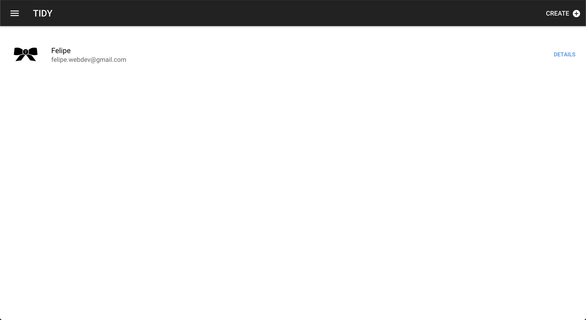
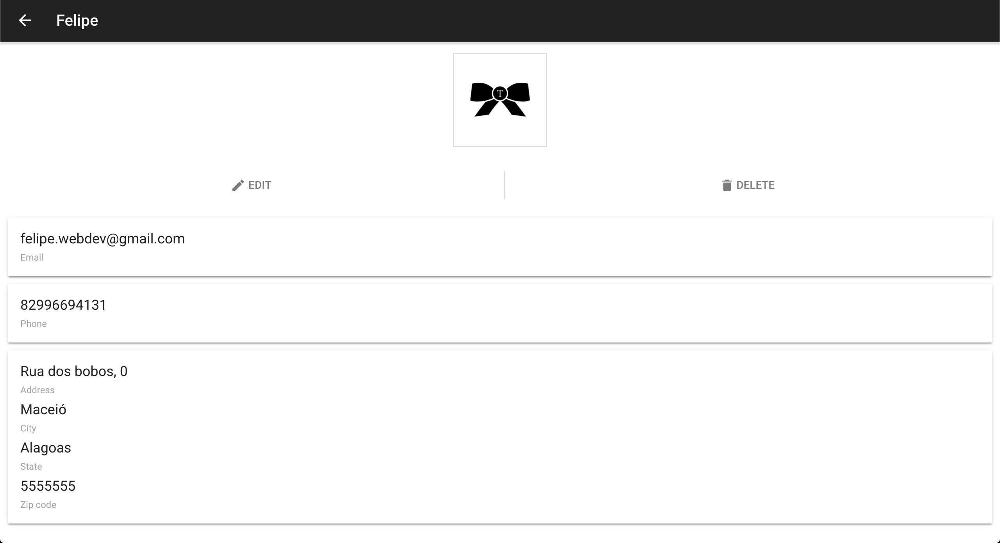
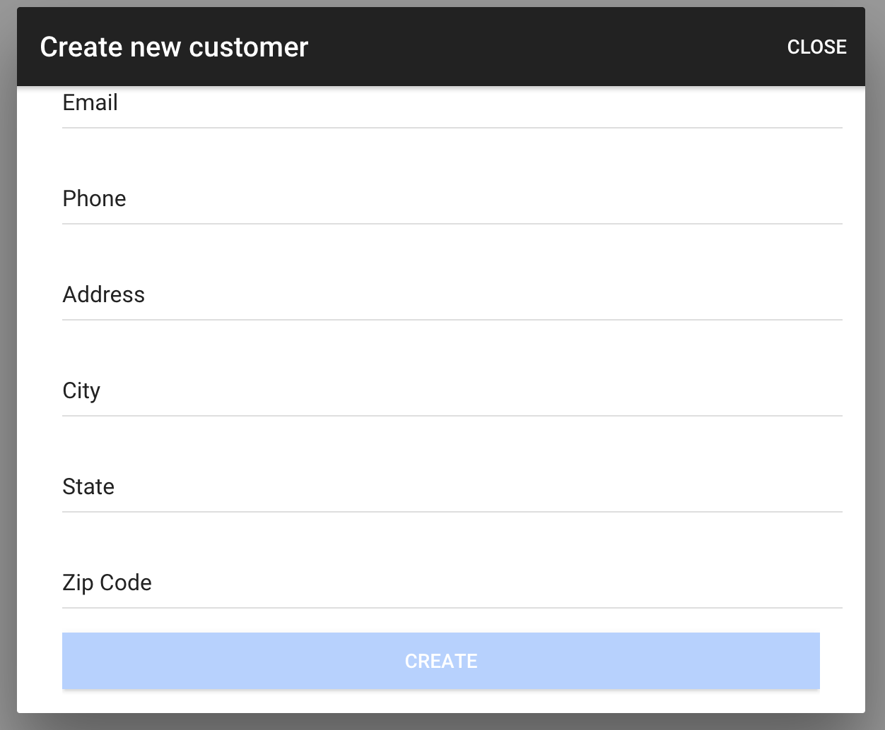

TIDY - Frontend
===================


Project created with [Ionic Framework](https://ionicframework.com) using Angular.

----------
[Live preview](https://tidy-challenge.firebaseapp.com/)

----------


## Runing this project

##### Make sure that `ionic`  and `cordova` utilities are installed:
```
$ npm install -g ionic cordova
```
##### Install npm dependencies
```
$ npm install 
```

##### Runing the app in localhost:
```
$ ionic serve
```

##### Adding platforms:
```
$ ionic cordova platform add android
$ ionic cordova platform add ios
$ ionic cordova platform add browser
```

##### Run the app in a devices ( android/ios ):
```
$ ionic cordova run android 
$ ionic cordova run ios
```

##### Building the app to production :

```
$ ionic cordova build android --prod
$ ionic cordova build ios --prod
$ ionic cordova build browser --prod
```

----------

## Gallery

### Home Screen
<p>

</p>

### Costumer Detail Screen
<p>

</p>

### Costumer Form Screen
<p>

</p>
